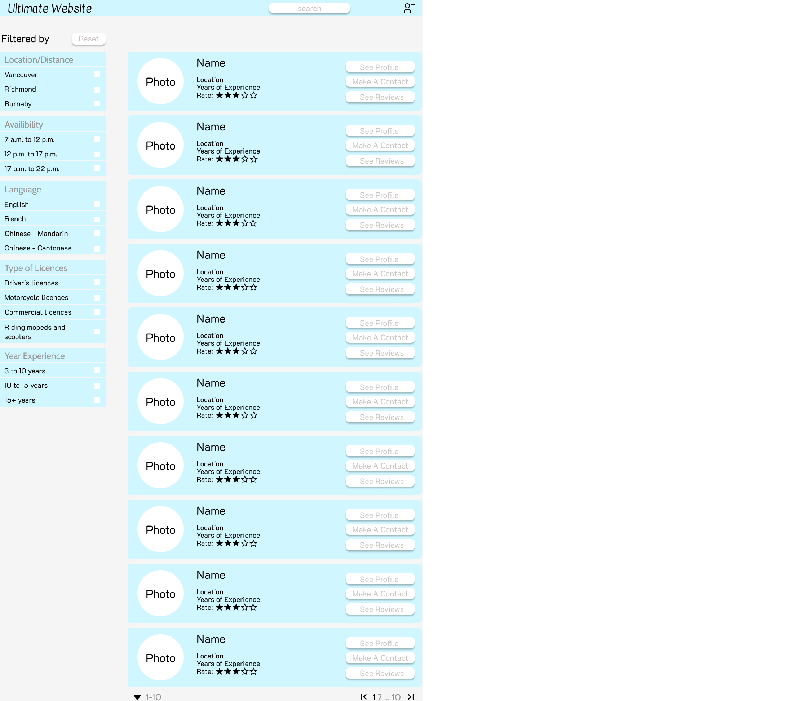
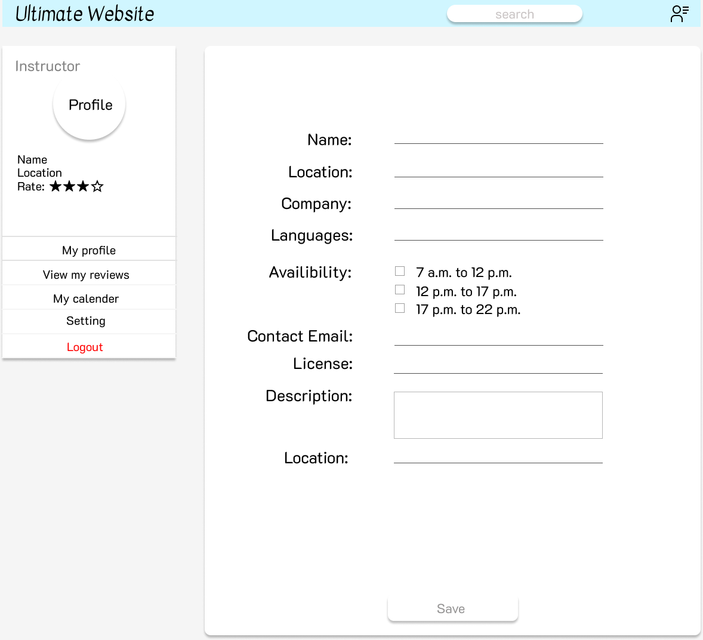
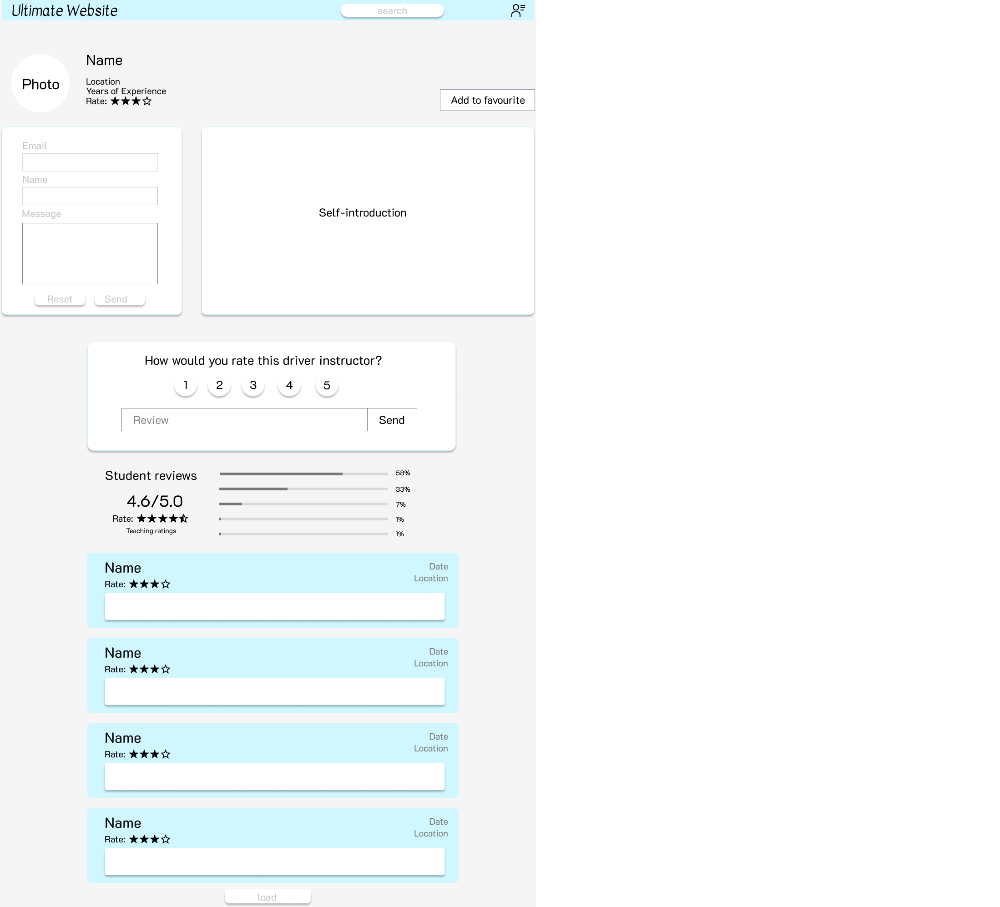

# CPSC 455 Project
CPSC 455 2022S **Team 405 Found**
## Project Description
- The targeted users for this project are driving instructors and people seeking to get driver license in BC. It provides a platform for student drivers to find ideal instructors based on locations, services they need etc. 
- Future drivers can browse a list of instructors. They can also rate instructors. Instructors can put their information on the website to advertise their services. Users can create accounts to see their reviews/advertisements.
- It will store profiles of driving instructors, their services and reviews from previous students. Student drivers can choose instructors based on the information mentioned above and get in touch with the instructors. 
- One additional functionality we can add is to arrange appointments for instructors and students. We are also planning to add Google Maps API to show all the instructors in users' neighbourhood. Adding searching/filtering is also a good idea.

## Project Task Requirements
**Minimal Requirements**
  - [ ] Adding/Deleting/Modifiying new instructor profiles
  - [ ] Adding/Deleting/Modifiying a review 
  - [ ] User registration/login/authentication
 - [ ] Main page to show all the instructors
  - [ ] Student profile page (editing profile, see all the reviews)

**Standard Requirements**

  - [ ] Filter instructors according to a search criteria
  - [ ] Instructor profile page (editing profile)
  - [ ]  Like and save instructors to "My Favourite Instructors List"
  - [ ]  Advanced search for instructors
  - [ ]  List instructor availability in a calendar view
  - [ ]  Link instructors to driving school/company\
 
 **Stretch Requirements**
 

   - [ ] Link with Google Map API to show instructors nearby me
   - [ ] User quiz and recommend a instructor
   - [ ] Write comments/reviews anonymously, and anonymous posts are only visible to us

## Sketch

